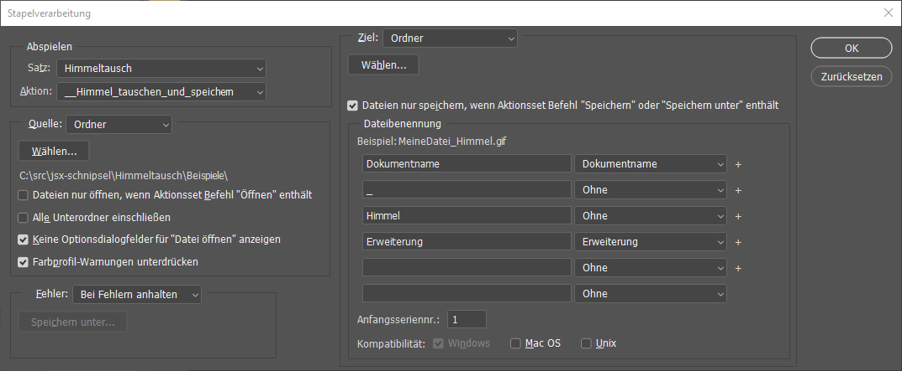
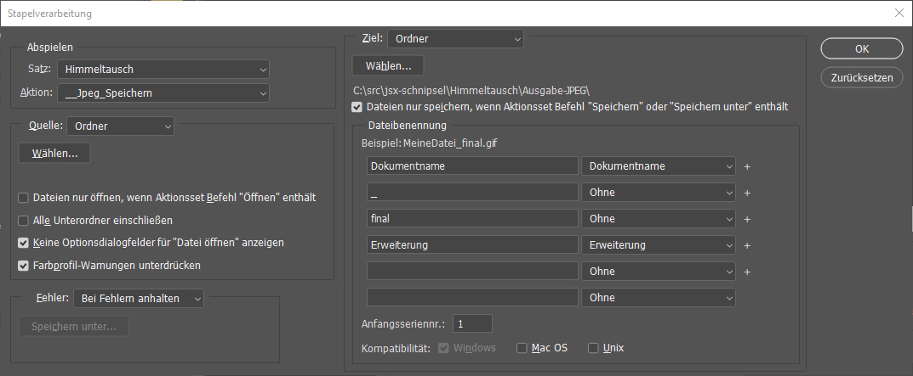

# Massenweise Himmel tauschen

Angeregt durch: https://www.facebook.com/groups/rickmaschke/posts/1557635034677218/

Wie kann man automatisiert für eine große Anzahl von Bildern den Himmel austauschen?

## Bestandteile:

1. Das Aktionspaket Himmeltausch.atn 
1. Das Skript Himmeltausch.psjs

(Siehe weiter oben: Am besten jeweils ein Rechtsklick auf den Link und dann "Ziel speichern unter...")

## Vorbereitung:

Aktionspaket in PS installieren und die Skriptdatei irgendwo - wiederfindbar - in ein Verzeichnis packen.

Das Aktionspaket enthält eine Aktion namens "_ZufallsaktionAbspielen", die muss man modifizieren. Das geht so:

1. Irgendein Beispielbild öffnen
1. Den Punkt "Javascript ausführen...." löschen
1. Die Aufzeichnung starten
1. Menübefehl aufrufen: Datei -> Skripten -> Durchsuchen...
1. Die Datei "Himmeltausch.psjs" auswählen
1. Aufzeichnung stoppen

Momentan gibt es in dem Aktionssatz 4 verschiedene Aktionen, "Himmel01" bis "Himmel04", die jeweils einen anderen Himmel benutzen. Das lässt sich aber leicht ergänzen, indem man noch mehr solche Aktionen in den Aktionssatz einfügt. Wichtig ist dabei dass alle diese Aktionen mit dem Wort "Himmel" beginnen - das Skript dursucht nämlich in diesem Aktionssatz alle Aktionen, die mit "Himmel" beginnen und wählt zufällig eine der Aktionen aus.

## Benutzung:

In der ersten Phase wird bei allen Eingabebildern der Himmel ausgetauscht (nach dem Zufallsprinzip) und eine automatische Tomwertkorrektur durchgeführt. Das Ergebnis wird im PSD-Format gespeichert.

Dazu dient die Aktion "START-Stapelverarbeitung". Es öffnet sich der Dialog der Stapelverarbeitung

Hier muss man Quell- und Zielverzeichnis angeben. Alle anderen Einstellungen können übernommen werden. Trotzdem wichtig: Ob wirklich die Aktion "Himmeltausch / __Himmel_tauschen_und_speichern" hier angewählt ist.

Die Ergebnisse landen im angegebenen Zielverzeichnis im PSD-Format. An den Dateinamen wird das Suffix _Himmel angefügt.

Für das (hoffentlich glückliche) Ende gibt es noch die Aktion "START-Jpeg-Ausgabe". Diese benutzt wiedeum die Stapelverarbeitung, um alle PSDs aus dem vorigen Schritt als JPEG abzuspeichern. 

